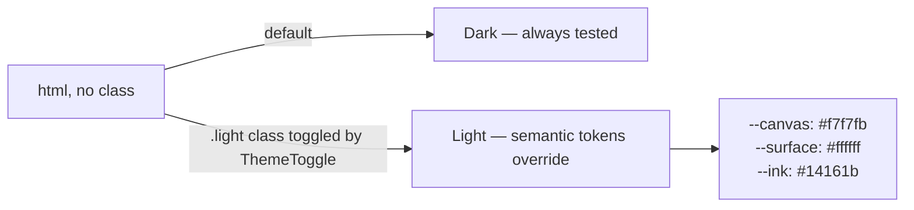

# Design System

## Direction

UX patterns inspired by consumer fintech apps (clear progressive
steps, card-based transaction history, confirmation-first flows) —
kept honest about scope: this is pattern inspiration, not a
pixel-verified clone of any specific app, since no design tokens were
extracted from a live reference. The brand's own accent — a restrained
indigo-violet — replaced an earlier green palette that read as
generic/templated rather than banking-grade.

## Color tokens

Defined once in `tailwind.config.js` and `index.css`; every component
consumes the token, not a hardcoded hex value.

| Token | Dark (default) | Purpose |
|---|---|---|
| `brand-500` | `#6c56e3` | Primary actions, links, brand mark |
| `success-500` | `#3d7ee8` | Verified/compliant states — a professional **blue**, not green, matching real banking "verified" badges |
| `navy-950` / `--canvas` | near-black | Page background |
| `--surface` | `#12141b` | Card/panel background |
| `--ink` / `--ink-muted` | near-white / grey | Primary / secondary text |

## Light mode

Implementation: `ThemeToggle.jsx` toggles a `.light` class on
`<html>` and persists the choice in `localStorage`. Rather than
prefixing every utility class with `dark:` across ~25 components (a
much larger undertaking), semantic CSS-variable tokens (`bg-canvas`,
`bg-surface`, `text-ink`, `text-ink-muted`, `border-hairline`) were
introduced and applied to the highest-traffic surfaces first —
**Navbar, Footer, and the Home page** — verified by screenshot in both
modes. The hero section deliberately keeps its own dark gradient in
both modes (a common, legitimate "dark hero over a light page"
pattern); its text is intentionally left as literal white rather than
tied to the theme token, since the section's background doesn't
change with it.


Remaining pages (Send Money, Payment, Track Transfer, Tamper Demo,
etc.) still use the original dark-only classes and have not yet been
converted to the semantic tokens. The pattern is established and
tested; extending it page by page is the natural next increment, not
a redesign from scratch.


## What changed and why

| Before | After | Why |
|---|---|---|
| Green accent (`brand`, `success`, plus 8 hardcoded hex values in `index.css`) | Indigo-violet accent throughout | Read as a generic AI/crypto template; a single restrained accent is closer to real banking-app convention |
| "Verified" = green | "Verified" = blue | Matches how banks and platforms (e.g. verified-account badges) typically signal trust — green was overloaded with the brand color it's now separate from |
| No light mode | Toggleable light mode on primary surfaces | Requested; implemented as a real, screenshot-verified feature rather than a superficial CSS filter |
