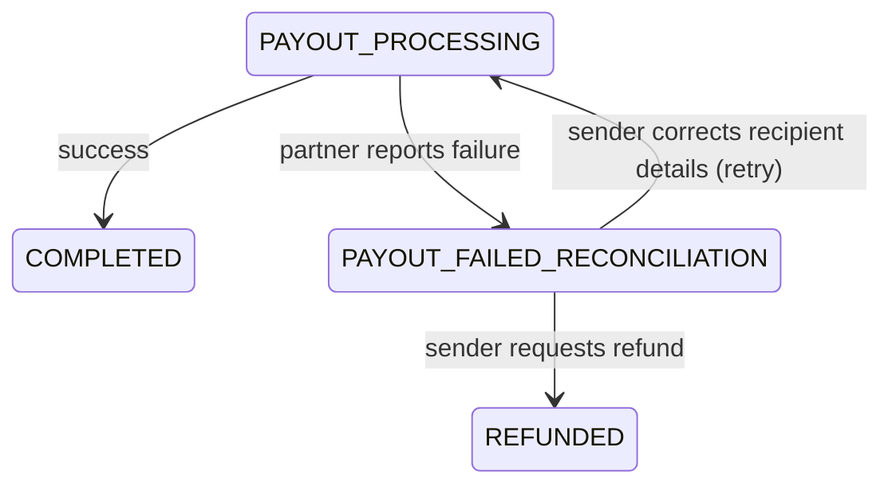

# Payee Verification & Failed Settlement

Two open questions any real remittance product has to answer. Both
have real, standard industry answers — neither is something we invent.

## Does the destination account name match the recipient?

This is a solved problem with a name: **Confirmation of Payee (CoP)**
in the UK, and **Verification of Payee (VoP)** as an EU-wide mandate
taking effect in 2026 under the EPC VoP Rulebook. Before a transfer is
sent, the account name and IBAN/sort code are submitted to the
**receiving bank**, which returns one of:

| Result | Meaning | Our handling |
|---|---|---|
| `matched` | Name and account align exactly | Proceed automatically |
| `partial_match` | Close but not exact (e.g. "J. Smith" vs "John Smith Ltd") | Show the discrepancy, let the sender confirm or correct |
| `not_matched` | Details don't correspond to the account | Block the transfer; ask for corrected recipient details |
| `unavailable` | The receiving bank doesn't support the check | Proceed, flagged as unverified |


This check happens **between banks** — only a party with a banking
relationship can query it. That means it is performed by our
**licensed payout partner**, not by us. We display the result; we
don't (and structurally can't) perform the check ourselves. This is
the same non-custodial boundary as everywhere else in this
architecture.


## What happens if the destination bank doesn't accept the funds?

A transfer can fail after our settlement leg has already completed —
the account may be closed, the CoP/VoP check may return `not_matched`,
or the receiving bank may reject the payout for its own reasons. This
needs a state the transfer can sit in, rather than silently disappearing
or being reported as delivered when it wasn't.

### Proposed state: `payout_failed_reconciliation`

The stablecoin leg to the licensed partner may have already settled by
this point — that's a separate concern from whether the *final* fiat
leg succeeded, which is exactly why this needs its own explicit state
rather than being folded into "completed" or silently retried.


Not yet implemented in code — this is a specified data-model and
state-machine addition. Building it requires a real payout partner's
failure-notification webhook to design against, which this project
doesn't have yet (see [Roadmap](../project/roadmap.md)).

