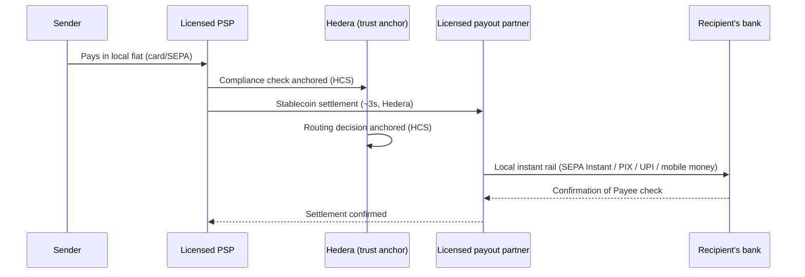

# Settlement Speed by Corridor

Delivery time is driven by which **local instant-payment rail** the
destination currency actually has — not a flat estimate for every
bank transfer. Mobile money already settles in minutes; a bank
transfer to a currency with a confirmed instant rail is seconds, not
days. Where no instant rail is confirmed, we show a conservative
standard-transfer estimate rather than guessing.

## Verified rails, by currency this platform supports

| Currency | Country | Rail | Settlement | Source |
|---|---|---|---|---|
| EUR | Eurozone | SEPA Instant | < 10 sec | EPC |
| USD | United States | RTP / FedNow | seconds | The Clearing House / Federal Reserve |
| GBP | United Kingdom | Faster Payments | < 2 min | Pay.UK |
| INR | India | UPI | < 10 sec | NPCI |
| BRL | Brazil | Pix | < 10 sec | Banco Central do Brasil |
| MXN | Mexico | SPEI | < 30 sec | Banco de México |
| SGD | Singapore | FAST / PayNow | < 1 min | MAS |
| NGN / GHS / UGX / TZS | Nigeria, Ghana, Uganda, Tanzania | Mobile Money | ~2 min | Local telco rails |
| KES | Kenya | Mobile Money (M-Pesa) | ~1 min | Safaricom |
| BDT | Bangladesh | Mobile Money (bKash) | ~2 min | bKash |

Every other supported currency defaults honestly to **1–2 business
days via standard bank transfer** — stated as an estimate, not dressed
up as a confirmed instant rail we haven't verified.


This table lives in code, not just documentation:
`frontend/src/data/settlementSpeed.js`. The "Estimated delivery" field
on the transfer summary reads from it live — pick EUR as the
receiving currency and the summary shows "10 seconds (SEPA Instant)",
not a generic default.


## Why the stablecoin leg is fast but not the whole story

The Hedera leg (compliance anchor + stablecoin transfer) is genuinely
fast — seconds, deterministic. But the number the sender actually
cares about is the **last mile**: whether the destination currency has
its own instant rail. That is what `settlementSpeed.js` reports
honestly, corridor by corridor.

## What this does *not* claim

Anchoring a compliance or routing decision on Hedera proves that
record hasn't been tampered with. **It does not prove the money has
landed in the recipient's account** — that confirmation still comes
from the destination bank, via the local rail above or a traditional
SWIFT confirmation where no instant rail exists. These are two
separate guarantees; conflating them would be a real overclaim. See
[Payee Verification & Failed Settlement](payee-verification.md) for
the reconciliation path when that final confirmation doesn't arrive.
