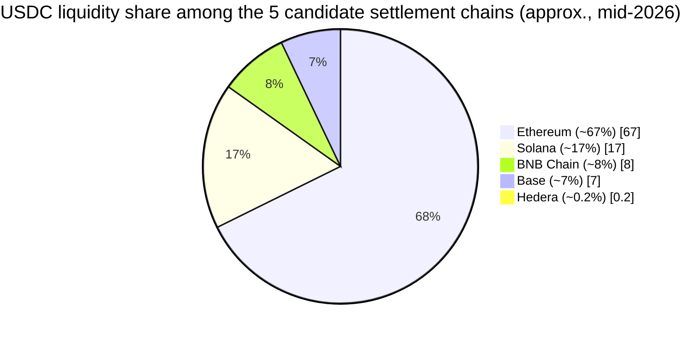

# Stablecoin Market Share by Chain

Two different questions, easy to conflate, answered separately here:

1. **Which ledger do we anchor compliance and routing evidence to?** Always Hedera — this is a fixed architectural decision, not a competition. See [The Trust Layer](trust-layer.md).
2. **Which chain actually settles the stablecoin leg of a given transfer?** This *does* depend on liquidity depth, and Hedera is not automatically the answer — see below.

## Why Hedera wins the anchoring decision regardless of its liquidity

Hedera's fixed, USD-denominated fees, aBFT deterministic finality, and Hedera Consensus Service's purpose-built consensus-timestamping are what the compliance trail needs. None of that depends on how much USDC sits on Hedera's own DEXs. A hash and a timestamp cost the same whether the ledger underneath has $100 million or $100 billion in stablecoin liquidity.

## Why liquidity depth still matters — for the *other* decision

The moment a transfer's stablecoin leg is large enough that Hedera's own liquidity could cause slippage, the routing decision (see [The Settlement Layer](settlement-layer.md)) needs a deeper pool elsewhere. This is where Ethereum, Solana, BNB Chain, and Base come in — not as replacements for Hedera's role, but as the *settlement* rail when the *amount* requires it.

## USDC supply by chain, mid-2026


Figures below are approximate and dated — on-chain stablecoin supply moves daily, and different trackers (DeFiLlama, Circle's own Reserve Reports) report slightly different snapshots depending on the exact date queried. Re-verify before citing a specific number as current.


| Chain | USDC supply (approx., mid-2026) | Share among these 5 chains | Source basis |
|---|---|---|---|
| **Ethereum** | ~$32-51B | ~67% | Circle transparency reports / DeFiLlama, Apr-May 2026 (66-70% of Circle's ~$73.6B total USDC float) |
| **Solana** | ~$7.7-12B | ~17% | DeFiLlama per-chain endpoint, Apr-Jun 2026 (10-20% of global USDC, second-largest chain) |
| **BNB Chain** | ~$5B (estimated) | ~8% | BNB Chain's *total* stablecoin supply reached $17.85B in Apr 2026, overtaking Solana — but 60-66% of that is USDT (not MiCA-compliant, excluded from this design). The USDC-specific slice is estimated from the remaining share, not separately reported by name. |
| **Base** | ~$4.3B | ~7% | DeFiLlama, May 2026 snapshot (5.6% of global USDC supply) |
| **Hedera** | ~$0.1B ($75-115M) | ~0.2% | SaucerSwap TVL via DeFiLlama, Q3 2025 — Hedera does not appear as a named chain in most major stablecoin-supply trackers, which is itself informative about relative scale |



At true proportional scale, Hedera's slice is a sliver too thin to render as a visible wedge on the pie above, roughly one degree of the full circle. That's not a missing data point; the bars below use the same numbers on a scale where a small value still shows as a visible, labeled bar, specifically so the smallest three aren't rendered as nothing:

```
Ethereum   ██████████████████████████████████████████████████████████████  67%
Solana     █████████████████                                                17%
BNB Chain  ████████                                                          8%
Base       ███████                                                           7%
Hedera     ▏                                                               0.2%
```

## The honest read of this chart

Hedera's slice is barely visible, and that is exactly the point being made, not a weakness being hidden. Hedera was never chosen for stablecoin liquidity depth; it was chosen for what [The Trust Layer](trust-layer.md) needs. The other four chains exist in this design specifically *because* Hedera's liquidity is this thin — the [routing decision](settlement-layer.md) checks real liquidity data and falls back to deeper pools automatically once an amount is large enough that settling on Hedera itself would risk slippage.

Ethereum's ~67% share is also worth reading correctly: it reflects **institutional custody balances**, not necessarily payment velocity. Solana and Base, despite much smaller supply, process large *transaction volumes* relative to their size — supply share and usage share are different metrics, and citing one to imply the other would be a real error.
