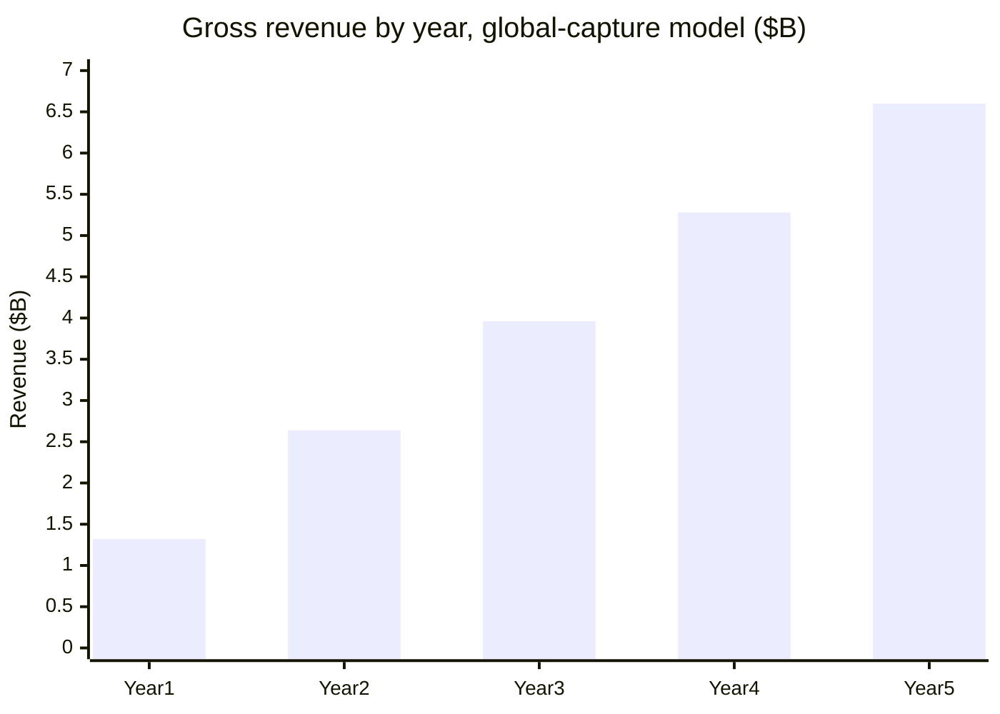

# 5-Year Revenue Projection: Global Freelancer Capture Model

This page follows one specific calculation method, worked exactly as specified, with every input either cited or explicitly labeled as an assumption.

## Inputs

**Global freelancer population: 154 million.** This is the conservative, survey-based estimate for *online/digital gig workers specifically* (DemandSage, HRStacks, 2026), not the much broader "1.57 billion globally self-employed" figure some sources cite. That broader number includes all informal self-employment worldwide (market vendors, small farmers, local tradespeople), the overwhelming majority of whom would never need a cross-border digital payment service at all. 154 million is the defensible base for *this* calculation; using 1.57 billion would inflate every result below by roughly 10x on a population that mostly isn't addressable by this product.

**Fee: 4.7625%,** 25% below the real 6.35% global average remittance cost (World Bank, Q1 2024, already cited in [Market Analysis](market-analysis.md)).

**Average transfer volume: $1,500/month per user** ($18,000/year), as specified.

**Capture rate: 1% of the global freelancer population in Year 1, increasing by 1 percentage point per year** (1%, 2%, 3%, 4%, 5% through Year 5), as specified.

## The calculation

| Year | Capture | Users | Annual transfer volume | Gross revenue (fee) |
|---|---|---|---|---|
| 1 | 1% | 1,540,000 | $27.72B | **$1.32B** |
| 2 | 2% | 3,080,000 | $55.44B | **$2.64B** |
| 3 | 3% | 4,620,000 | $83.16B | **$3.96B** |
| 4 | 4% | 6,160,000 | $110.88B | **$5.28B** |
| 5 | 5% | 7,700,000 | $138.60B | **$6.60B** |

## Note: the capture-rate assumption is the whole story

The arithmetic above is correct, and it's worth seeing exactly what it implies operationally, because the number is large enough that it needs a sanity check, not just a formula.

**1% of the global freelancer population in Year 1 is 1.54 million real people actually onboarded and actively transacting**, not a projection of interest or signups, active monthly users moving real money. Spread evenly across a year, that's **roughly 4,220 new active users every single day of Year 1**, for a company that, as of this writing, has no signed partner agreements yet (see [Go-to-Market Strategy](go-to-market.md)). By comparison, the three-country beachhead model in that same document treats *tens of users* in Year 1 as the realistic starting point.

**This isn't a reason to hide the number, it's the actual finding.** The gap between "1% of a global population" (sounds small) and "1.54 million active daily-transacting users" (is enormous for a pre-launch company) is precisely why go-to-market plans are built corridor-by-corridor and partner-by-partner rather than as a percentage of a global total. This page shows what that global ceiling looks like if this model ever reached that scale; it is not a Year 1 forecast, and shouldn't be presented as one without the operational context above attached to it.

## Caveats, stated plainly

- The 154M base is itself an estimate with real uncertainty (surveys of a population this size and this informally organized vary meaningfully by methodology); it's the most defensible figure found, not a precise count.
- This model shows gross fee revenue, not net margin. No partner pass-through, no fixed costs, no customer acquisition cost, are netted out here, unlike the corridor-specific model in [Go-to-Market Strategy](go-to-market.md), which does split revenue between this project and licensed partners.
- 1500/month and the 1%-per-year capture curve are both given assumptions, not independently sourced. Changing either changes every figure in the table proportionally.
