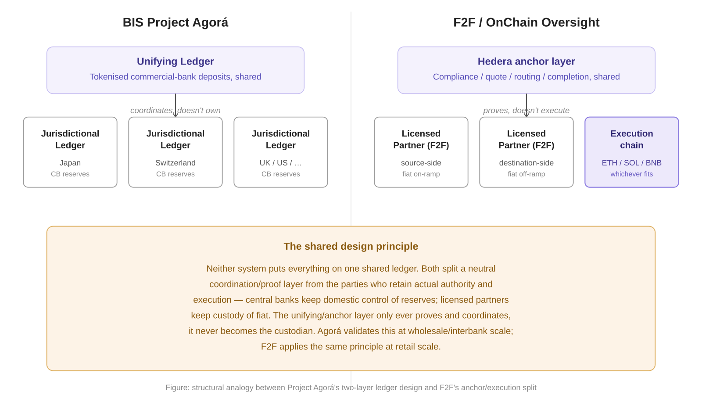

# A Regulator-Facing Case for Public Anchoring

Everything anchored to Hedera in this system — compliance, quote,
routing decision, completion — is readable by anyone through a public
Mirror Node, with no API key, no dashboard access, and no need to
trust our database. That property was built for auditability. It
also happens to be directly useful to regulators, and to a much wider
set of institutions than just this platform.

## What a regulator can actually observe

A regulator (or anyone) can query the Mirror Node for the HCS topic
this system anchors to and independently see, for any transfer:

- **When** a compliance check happened (consensus timestamp, not a
  timestamp we could backdate)
- **That** an FX quote existed at a given moment, immutable once
  anchored, so it can't be quietly revised after the fact
- **Why** a transfer settled on a given chain (the routing-decision
  anchor)
- **That** both counterparties independently confirmed completion
  (the HSS-gated completion anchor — see
  [The Trust Layer](../architecture/trust-layer.md#the-completion-anchor-gated-by-two-parties-not-one))

What they see is a hash and a pseudonymous reference, never a name,
account number, or KYC document — the plaintext stays off-chain with
the licensed party, per
[compliance-data.md](compliance-data.md). A regulator gets
proof that a compliant process happened and when, not the underlying
personal data. That split is deliberate: observability without a
privacy trade-off.

## Why this matters now, at retail/Phase 1 scale

This system's first phase targets individual retail transfers through
smaller sending platforms and community partners — exactly the
segment regulators most often lack the resources to audit deeply.
A retail money-transfer operator today is typically overseen through
periodic filings and after-the-fact requests for records, not
continuous, independently verifiable evidence. Public anchoring
lowers the cost of oversight for this segment specifically: a
regulator doesn't need to trust the platform's internal database or
wait for a formal disclosure request to confirm a compliance check
actually happened at the time claimed.

## Why the same pattern scales to large financial institutions

The infrastructure choice here — anchor a hash and a pseudonymous
reference to a public consensus network, keep the plaintext off-chain
— isn't specific to a small retail platform. It's a general pattern
for making any institution's compliance and settlement trail
independently verifiable without exposing customer data. For a large
financial institution, the value case is different in scale but the
same in kind:

- **Faster systemic-risk visibility.** Today, regulators reconstruct
  a large institution's transaction and compliance trail after a
  failure or a formal audit, often too late to act on. A public,
  consensus-timestamped trail gives regulators the same visibility
  continuously, not retroactively.
- **Lower audit friction.** Internal compliance systems are siloed by
  design; verifying them today usually means a formal request,
  institutional cooperation, and time. A publicly anchored hash trail
  can be checked by a regulator directly, on their own schedule.
- **Cross-institution consistency.** If multiple institutions anchor
  to the same public pattern, a regulator gains a consistent way to
  verify claims across firms, rather than learning each firm's
  internal reporting format separately.

## Independent validation at wholesale scale: BIS Project Agorá

This same structural principle, split the shared coordination layer
from the parties who keep actual authority, is already being tested
at the largest possible scale by the most conservative institutions
in finance. The Bank for International Settlements' **Project Agorá**
(seven central banks, including the Federal Reserve Bank of New York,
the Bank of England, and the Swiss National Bank, plus 40+ financial
institutions) published its prototype report in May 2026 and is now
moving to real-value testing.

Agorá's own design report states the core decision explicitly:
central banks wanted to retain local control, so tokenised commercial
bank deposits sit on a shared **unifying ledger**, while tokenised
central bank reserves stay on separate **jurisdictional ledgers**,
one per currency area, each under the relevant central bank's own
authority. The unifying layer coordinates; it never becomes the
custodian of any jurisdiction's reserves.

This is the same split this project makes, at a different scale:
Hedera anchors and proves (the unifying layer), while custody and
execution stay with the licensed partners and whichever settlement
chain fits the transfer (the jurisdictional layer). Agorá is also a
useful reminder of the open question at this pattern's frontier:
its own report notes the next phase must "examine how an Agorá-type
platform could operate within existing legal and regulatory
frameworks, including... laws designed to counter money-laundering."
Even a BIS-led consortium has not yet solved cross-jurisdictional
AML/CFT oversight for a multi-ledger system, which is precisely the
gap this project's regulator-oversight case, and its sister project
tackling on-chain agent activity, are aimed at.

## What this is not claiming

This is not a claim that F2F Cross-Border is itself a regulatory
reporting tool, or that anchoring alone satisfies any specific
jurisdiction's compliance regime — see
[why-this-is-legal.md](why-this-is-legal.md) for the actual
regulatory positioning of this project. The claim here is narrower
and, we think, more durable: the underlying infrastructure pattern —
public, consensus-anchored, privacy-preserving evidence of compliance
events — is a reusable choice that benefits regulatory oversight at
any scale, from a single retail corridor to an entire large
institution's transaction flow. This project is one concrete,
working demonstration of that pattern at the smaller end of that
range.
