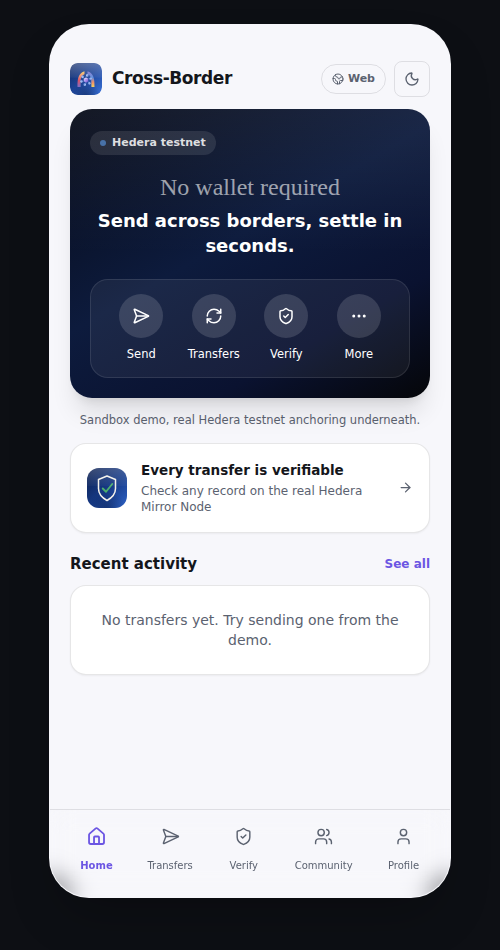
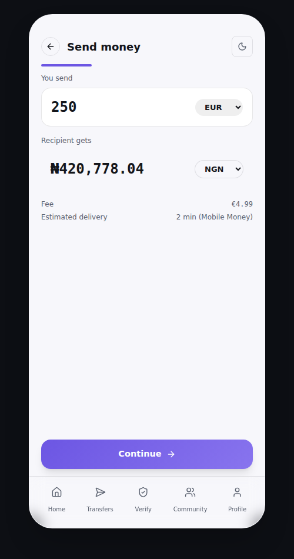
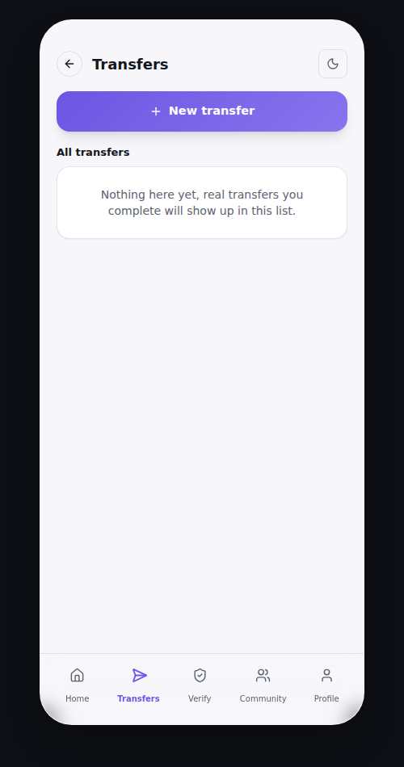
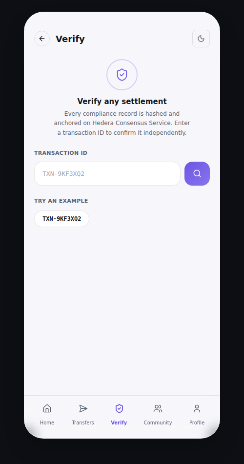
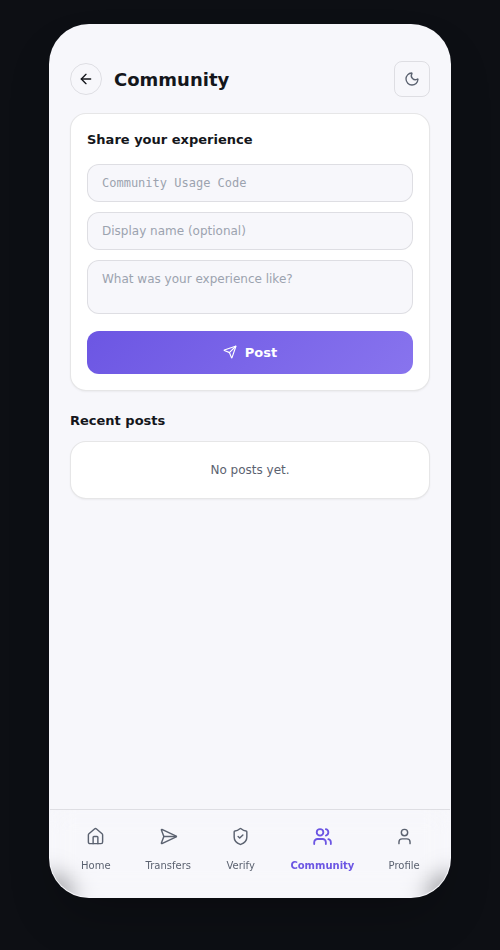
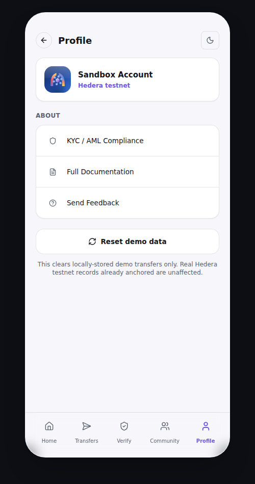

# App Tour

The app shell, a distinct mobile experience reachable at `/app`, with a screenshot of each screen. Opens with a tap-to-enter splash showing the full logo before landing on Home.

## Home

The main screen: a balance card on the Hedera testnet, quick actions (Send, Convert, Verify, More), a "Recent activity" list pulled from the real backend, and a callout linking straight to the real anchored records on the Hedera Mirror Node.

## Send

A compact, native four-step transfer flow living entirely inside the app shell, amount and currency, recipient and country, payout method, review, using the same real calculation utilities and the same real transfer-creation API as the web version, not a separate simulation. Ends with a Community Usage Code card when the resulting transaction has a real Hedera anchor.

## Transfers

The full transfer history, fetched from the real backend first (falling back to this device's local history only if the backend can't be reached), with a "New transfer" action leading into the same Send flow above.

## Verify

Enter any transaction ID to verify its compliance record against the real Hedera Mirror Node. Uses a minimal, hollow-outline shield icon rather than a filled badge. Includes a working example (`TXN-9KF3XQ2`) for a quick, real check.

## Community

The same Community feature as the web version, native to the app shell: a form requiring a real Community Usage Code plus a message, and the public feed of posts below it.

## Profile

Account info, appearance (light/dark) toggle, KYC/AML compliance status, links to full documentation and feedback, and a reset-demo-data control.

## Tab bar

Five tabs sit at the bottom of every screen: Home, Transfers, Verify, Community, Profile. The active tab gets a soft rounded highlight behind its icon and a bolder stroke weight.
