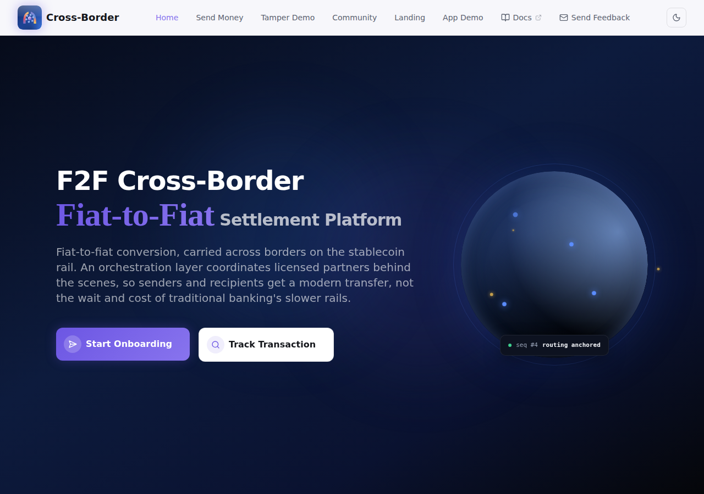
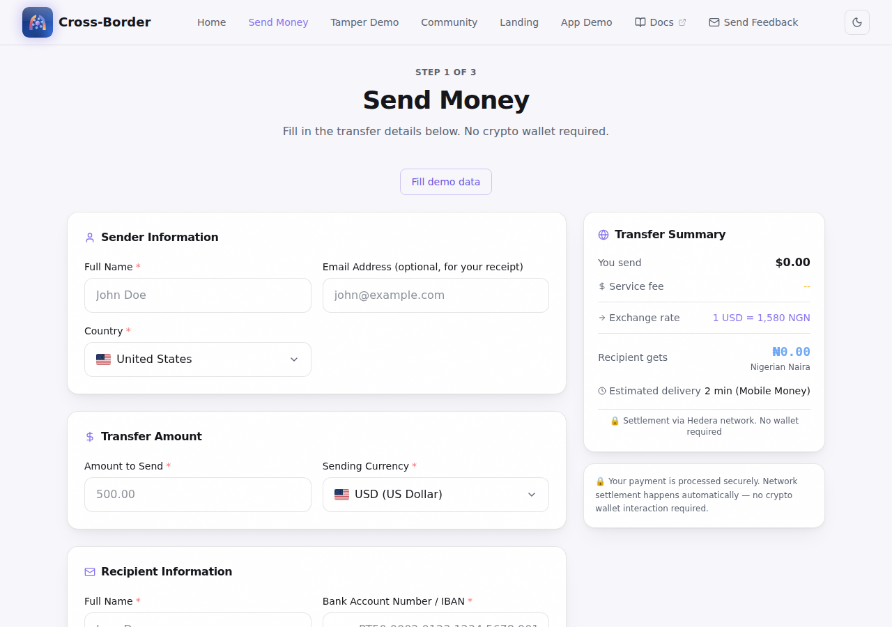
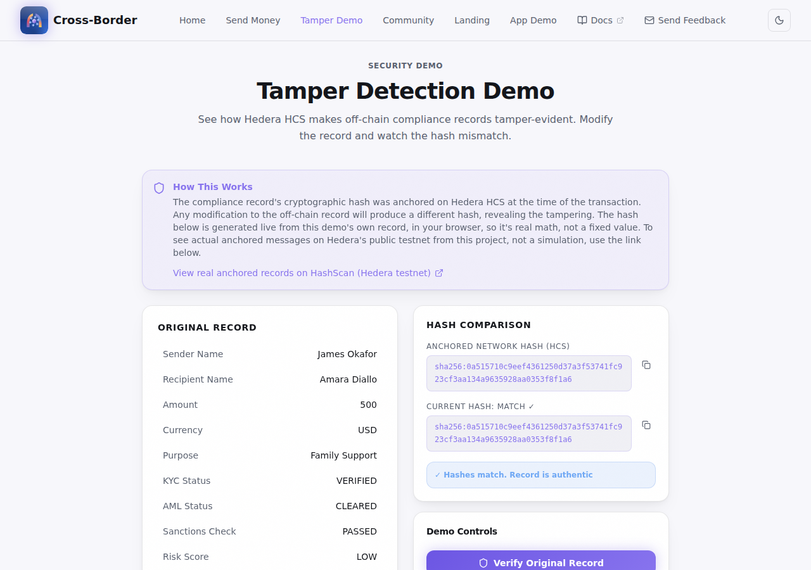
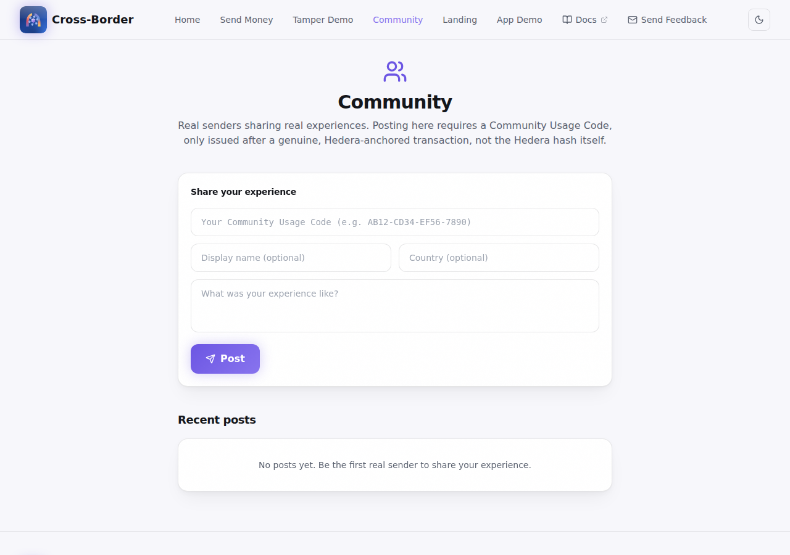
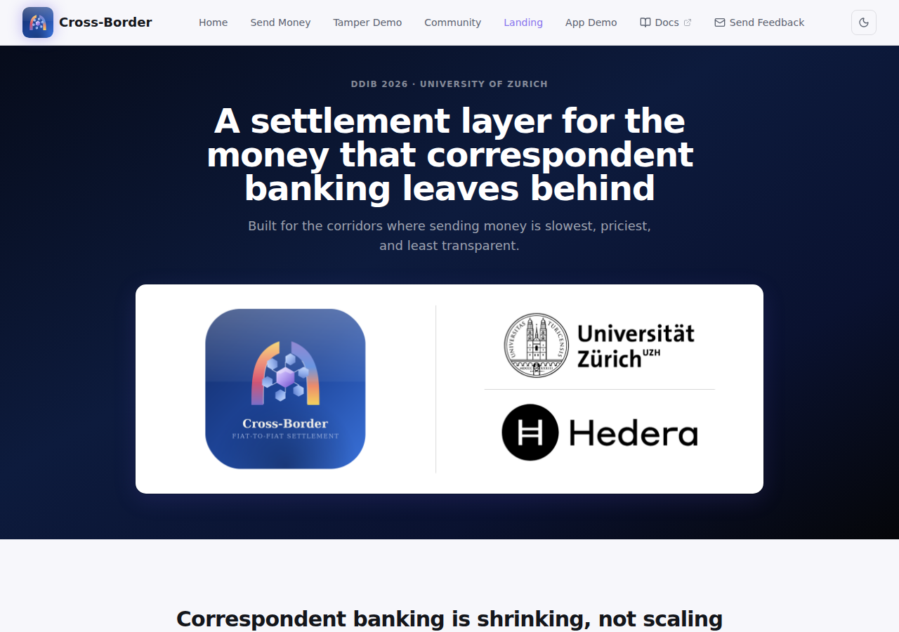

# Site Tour

Every page on the live site, with a screenshot and what it does.

## Home

The landing page. States the core promise directly: fiat-to-fiat conversion carried across borders on the stablecoin rail, with no wallet ever touching either side of the transfer. The globe on the right shows a live routing-anchor status card. Below the fold: hero statistics (countries, currencies, settlement speed, verifiability), the four core benefits (no wallet required, lightning-fast settlement, countries supported, compliance built in), a "how a transfer actually moves" walkthrough, the compliance and security section, supported currencies, potential settlement partners, and the settlement-networks breakdown showing Hedera as the always-on anchor network alongside where liquidity actually sits (Ethereum, Solana, BNB Chain, Base). Sections fade in with a soft blur as the page is scrolled.

## Send Money

The actual transfer flow: amount and currency, recipient details, payout method, review, and payment, a three-step form with no wallet address, private key, or seed phrase requested at any point. Submitting creates a real transfer through the backend, which anchors a compliance record to Hedera Consensus Service and settles through the corridor router.

## Tamper Demo

A live demonstration of why the Hedera anchor matters. Shows an original compliance record, its hash, and a button to modify the off-chain record. Modifying it and re-verifying flips the result from a match to a mismatch, in front of the person using it, not just described in text. Also links directly to the real anchored records on HashScan.

## Community

Where senders share real experiences. Posting requires a Community Usage Code, a code issued once, automatically, only after a transaction has a real Hedera anchor, not the Hedera hash itself (which is public and would let anyone post). The form rejects a missing or unrecognized code, and rejects a message under 5 characters.

## Landing

A pitch-style page: the problem (correspondent banking is shrinking, not scaling), the solution (breaking the route apart and riding the stablecoin rail), who feels this problem directly, and the first target markets by corridor.

## Track Transaction

Look up any transaction by ID and see its status, Hedera reference, and a path to independent verification. Falls back to the seeded demo transaction (`TXN-9KF3XQ2`) when nothing else is found, so the page always has something real to show rather than a dead end.

## Compliance Verification

The verification page for a specific transaction: the compliance record's fields, the Hedera Consensus Service reference (topic, transaction, consensus timestamp), and a button that checks the record's hash against what's actually anchored on the public Mirror Node, not a local simulation.

## Transaction Receipt

A printable/exportable receipt for a completed transfer: sender and recipient details, amounts and fees, status, and the Hedera network record. Includes the Community Usage Code card when the transaction has a real anchor.
